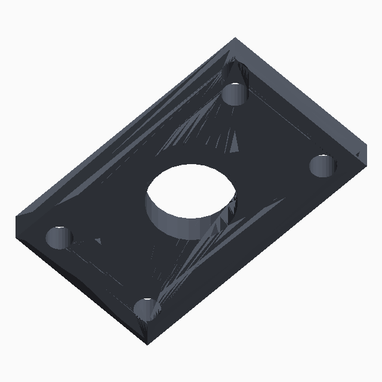

# EasyCAD — text-to-CAD plugin for DeepSeek Harness

`easycad` is an **out-of-tree plugin for [DeepSeek Harness](https://github.com/deepseek-ai/DeepSeek-Harness) (dsh)** that turns text prompts into real, parametric CAD. It uses the official dsh plugin contract (host tools + client slot + skill) and does not fork or patch the dsh source.

Ask for a part in plain language → the agent writes build123d Python, exports **STEP + GLB**, runs geometry **QA**, and opens a same-window CAD pane where you can tweak dimensions and re-generate. On an existing part, the pane’s **流道系统** workbench can propose and instantiate a die-cast gating (runner) tree.



## Features

- **Text → parametric CAD.** A `text-to-cad` skill drives brief → review → gen → QA → export, locking `overall_size_mm` and `special_features` from the prompt.
- **CAD as code.** Every part is a `gen_step()` build123d script (`from build123d import *`), not a mesh, with overall dimensions in a `PARAMS` dict so it stays editable.
- **Part memory.** One `models/<name>` binds to one dsh conversation. Switching files switches chats; cold start reads STEP facts / IR / PARAMS / QA.
- **Built-in geometry QA.** `single_body`, `watertight`, and `overall_dimension` (0.2 mm tolerance) checks with pass/fail verdicts.
- **Same-window CAD pane.** A workbench opens on the right of the dsh UI — model tree, shaded 3D view, parameter sidebar, face inspector, runner bench.
- **Parametric editing.** Change `length` / `width` / `height` / `hole_d` by clicking a face or via `easycad_apply`; STEP + GLB regenerate automatically.
- **Die-cast runner (P0).** On an existing part: brief → propose (A cost / B fill / C picked faces) → template solids → shot + split-open cavity preview. Not LLM Sweep.
- **Export.** STEP, STL, GLB (3MF planned).
- **Advisory similarity.** CAD-vs-reference-image silhouette IoU plus rule-based AI suggestions from QA + similarity + brief intent.

## Tools

| Tool | What it does |
|---|---|
| `easycad_memory` | Bind a part stem to the current dsh chat; inject facts / IR / PARAMS |
| `easycad_brief` | Write an engineering IR + brief (envelope, features, `single_body`/`watertight`) |
| `easycad_review` | Read-only IR vs intent/facts; call after brief, before gen |
| `easycad_gen` | Write `gen_step()`, export STEP+GLB, return `facts` + `qa`, open the pane |
| `easycad_inspect` | Re-measure geometry |
| `easycad_qa` | Pass/fail checks only |
| `easycad_measure` | Check named X/Y/Z overall sizes |
| `easycad_export` | STL / GLB from an existing part |
| `easycad_preview` | Show a part in the CAD pane |
| `easycad_params` | Read editable fields (`length`, `width`, `height`, `hole_d`) |
| `easycad_apply` | Apply param edits and regenerate STEP+GLB (or rebuild a runner shot) |
| `easycad_import` | Import an existing STEP into `models/<name>` |
| `easycad_snapshot` | Render ortho view PNGs (iso/front/right/top) |
| `easycad_similarity` | CAD-vs-reference-image silhouette IoU (advisory) |
| `easycad_advice` | Rule-based suggestions from QA + similarity + IR |
| `easycad_runner_brief` | Write gating intent (parting, gate count, keepout/gate faces) |
| `easycad_runner_review` | Read-only runner brief gate |
| `easycad_runner_propose` | Rank up to 3 candidates + section sizes |
| `easycad_runner_build` | Template solids → `models/<name>.shot.step/.glb` + cavity preview |
| `easycad_runner_qa` | Re-read last runner QA |

Reserved (schema only, not implemented): `easycad_part` · `easycad_assemble` · `easycad_dfam`.

## How it works

```
prompt ─▶ text-to-cad skill
          ├─ easycad_memory  (bind stem ↔ chat)
          ├─ easycad_brief   (lock overall_size_mm / special_features)
          ├─ easycad_review
          ├─ easycad_gen     (build123d → STEP + GLB, facts + qa)
          ├─ [pane opens]    (QA issues, params, face inspector, runner bench)
          └─ easycad_export  (STL / GLB)
```

Every generated `gen_step()` declares overall dims in a top-level `PARAMS` dict and references `PARAMS[...]` in the body — that's what keeps parts editable in the pane and via `easycad_apply`.

Die-cast gating stays on the same stem: `easycad_runner_brief` → `review` → `propose` → `build`. The pane switches **零件 | 流道系统**; build writes `models/<name>.shot.*` and `models/<name>.mold.*`, not a new part.

## Requirements

- Node.js 22
- A Python interpreter with `build123d` (and `numpy`; `PIL`/`trimesh` for image features)
- A dsh Web environment with your DeepSeek API key

## Install (native dsh)

The dsh package name is `easycad`; make it resolvable and patch one row.

```bash
# 1. Make the package resolvable
#    $DSH_HOME/profiles/node_modules/easycad  ->  <this-repo>/easycad/dsh-plugin

# 2. Point the CAD interpreter at a build123d-enabled Python
export EASYCAD_PYTHON=/path/to/python-with-build123d

# 3. Patch one row in your dsh patch file
#    - insert: { id: easycad, name: easycad }
```

If this repo sits next to a `deepseek-harness/` checkout, a local helper is:

```powershell
powershell -File scripts\start-dsh-web.ps1
```

Open http://127.0.0.1:3080 — set the DeepSeek API key under **Settings → Model**, workspace = this repo (or your EasyCAD root).

## License

MIT — see [LICENSE](LICENSE).
